# Circuit Analysis

## Effect of different circuts on Constructors based on laptime a erage

The analytical question proposed here is: 
 How well does each constructor perform on average at specific circuits: Do specific constructors perform better or worse at certain circuits? We can determine this by comparing the average lap times between constructors. (Q2 on the project proposal )

## 1. General analysis: Average lap time fo each circuit and constructor

<table>
  <tr>
    <td>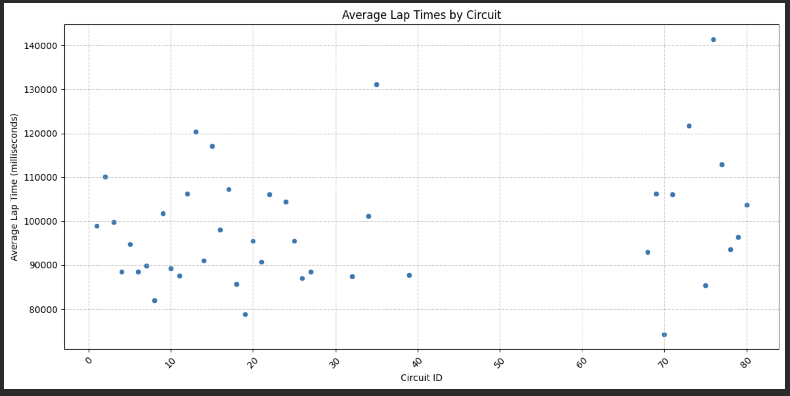</td>
    <td>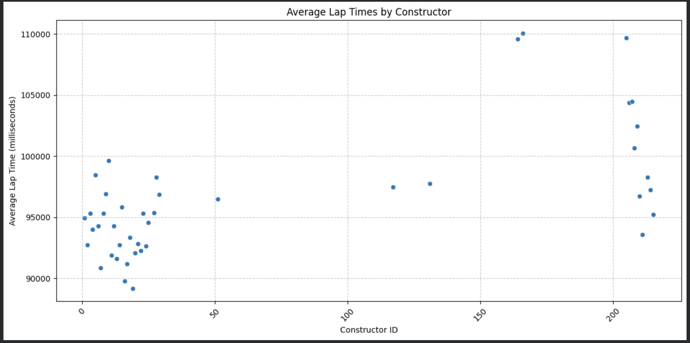</td>
  </tr>
</table>

As we can see from the two scatter plots above, there is both circuit dependence and constructor dependence on the average lap time.

## 2.Average lap time on each circuit for a specific constructor

<table>
  <tr>
    <td>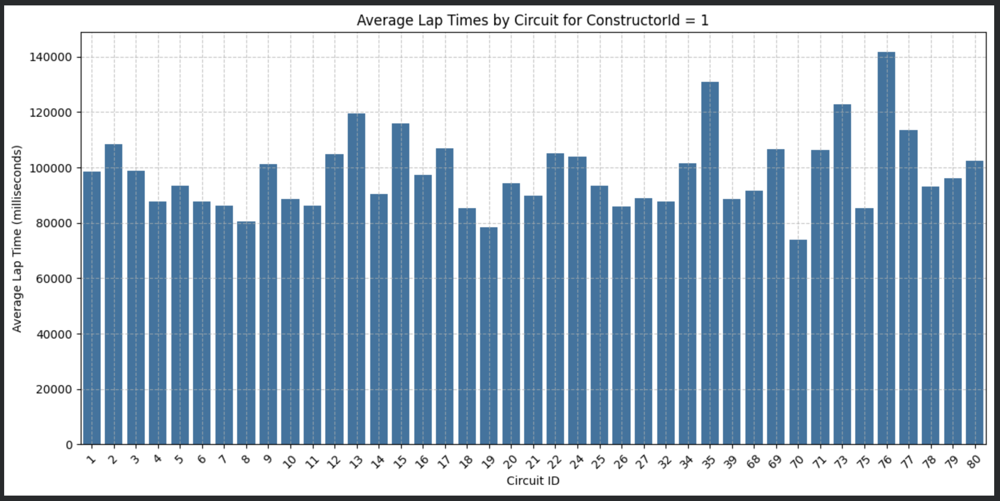</td>
    <td>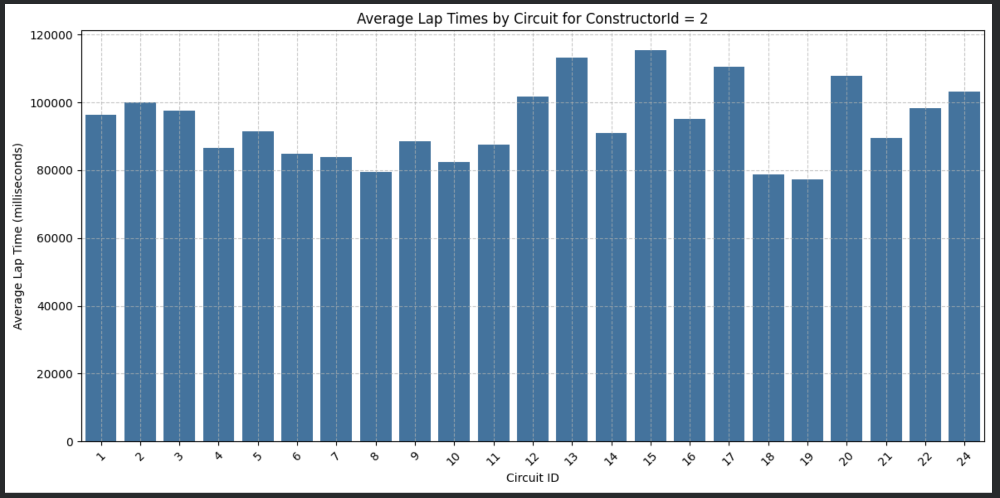</td>
  </tr>
</table>

Since there are 212 different constructors, two of them were chosen as examples. From the distribution in the above plots, it is clear that circuit dependency exists for each constructor as well.

## 3. Circuits that have the best performace and the circuits that have the worst performance over all the constructors

<table>
  <tr>
    <td>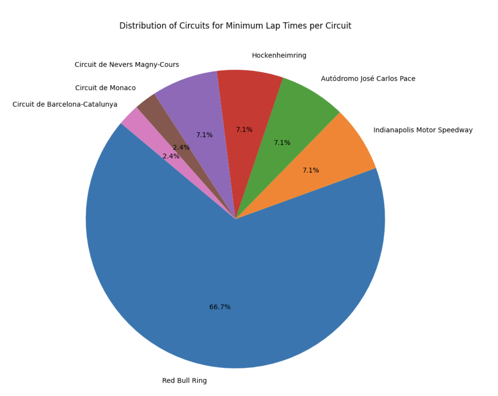</td>
    <td>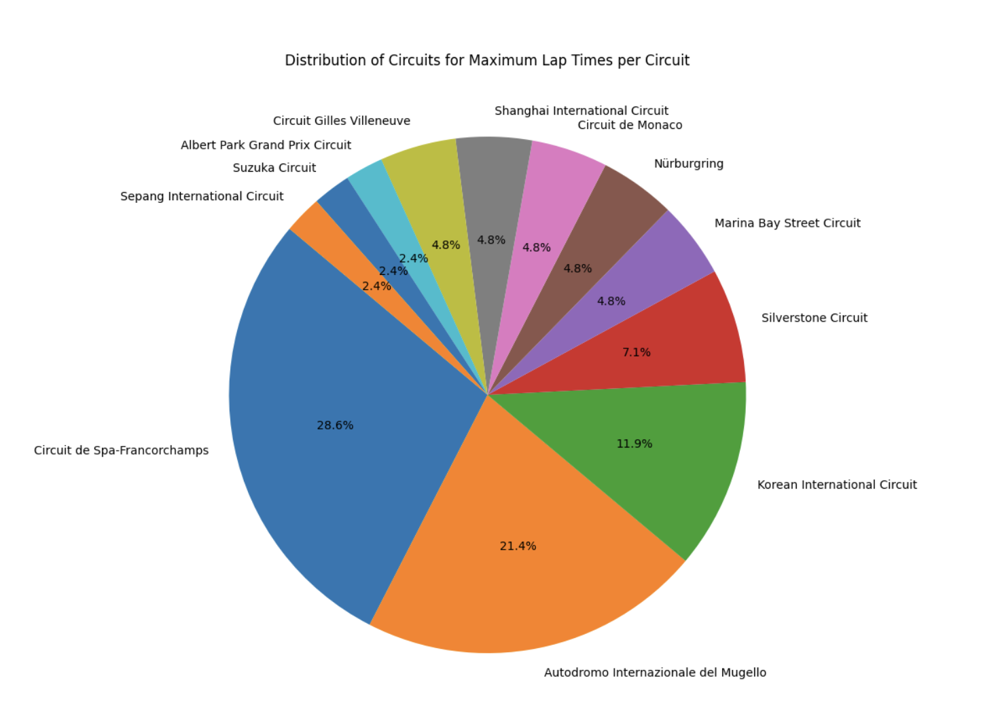</td>
  </tr>
</table>

Red Bull Ring has the shortest average lap time for most constructors, which means it tends to perform the best with various constructors. On the other hand, Circuit de Spa-Francorchamps and Autodromo Internazionale del Mugello seem to have the longest average lap times for many constructors.

## 4. Difference between the best peformance circuit and the worst peformance circuit

<table>
  <tr>
    <td>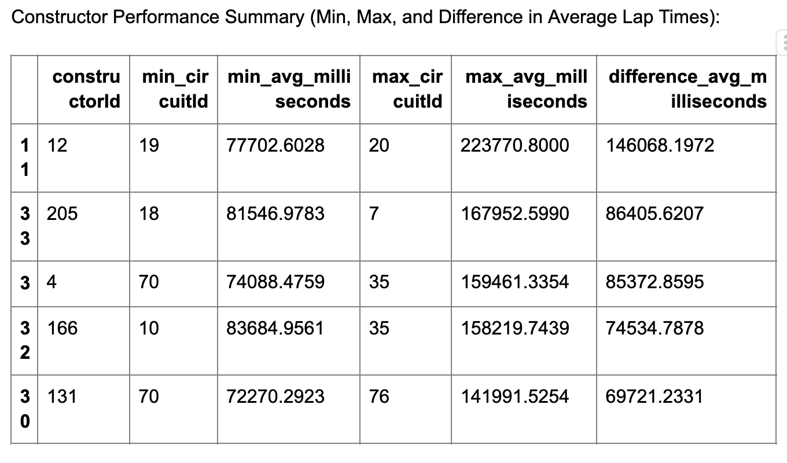</td>
    <td>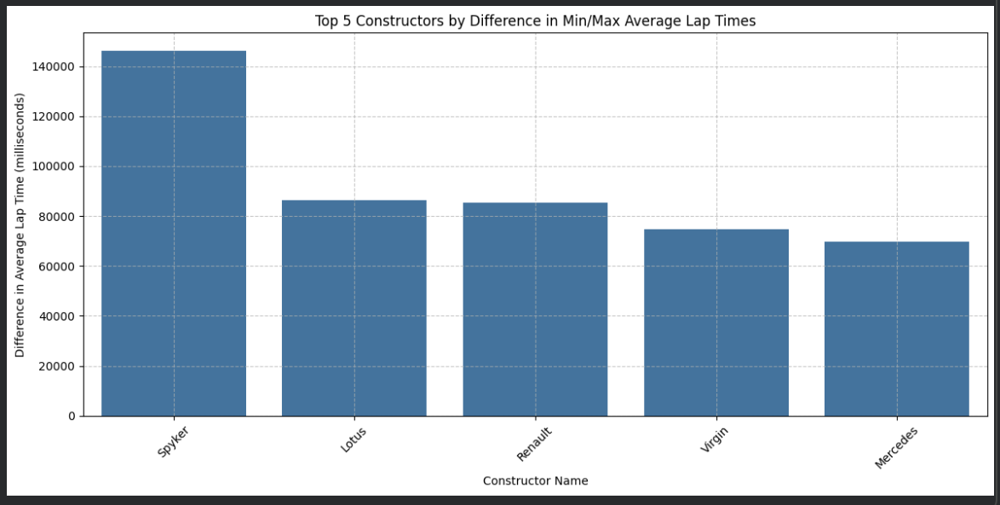</td>
  </tr>
  <tr>
    <td>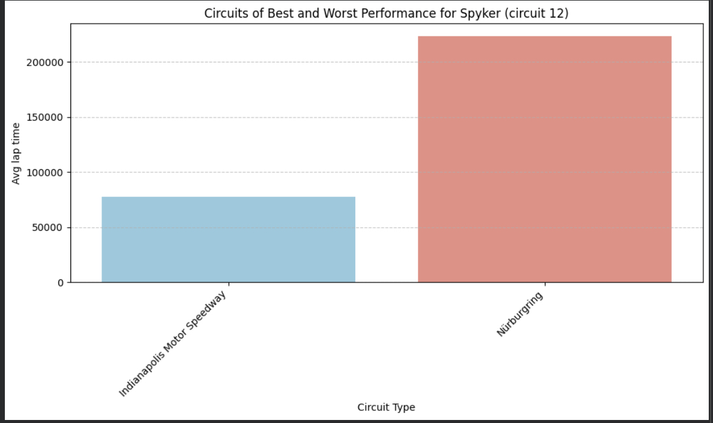</td>
    <td>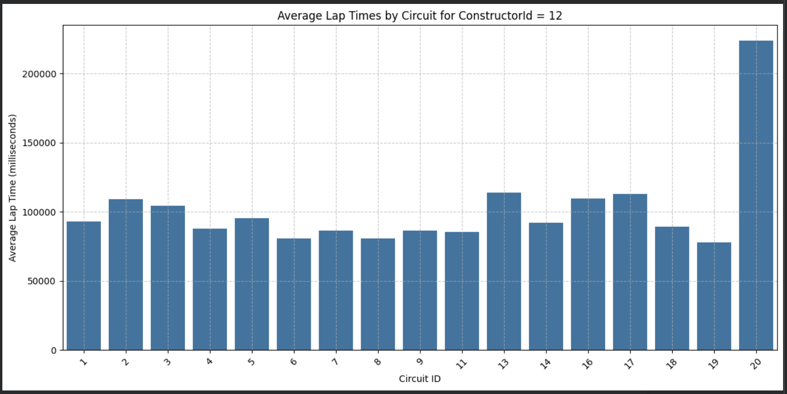</td>
  </tr>
  <tr>
    <td>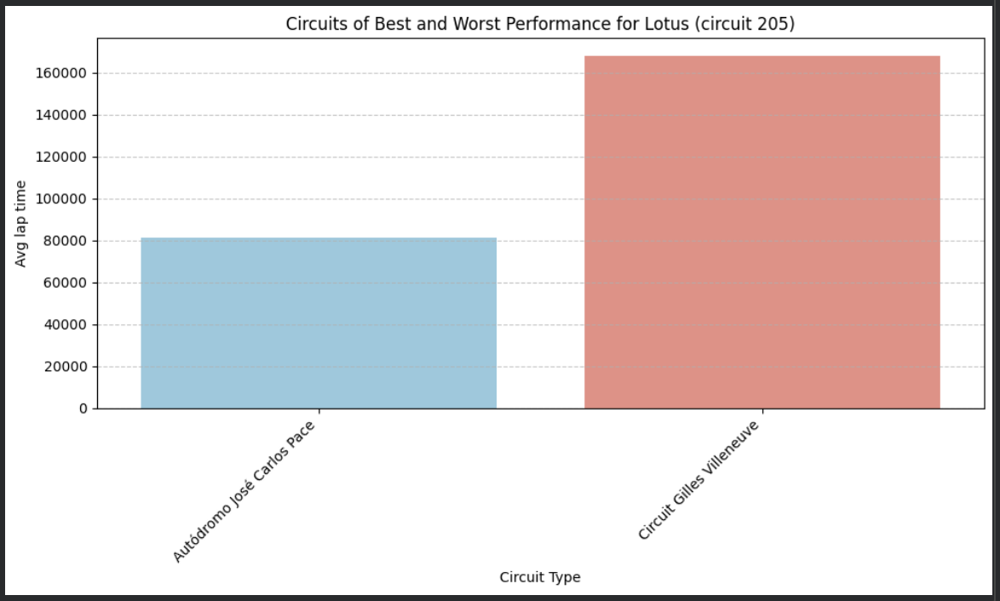</td>
    <td>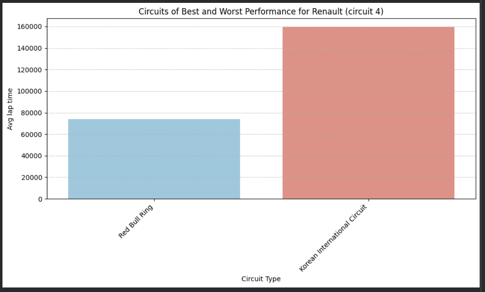</td>
  </tr>
  <tr>
    <td>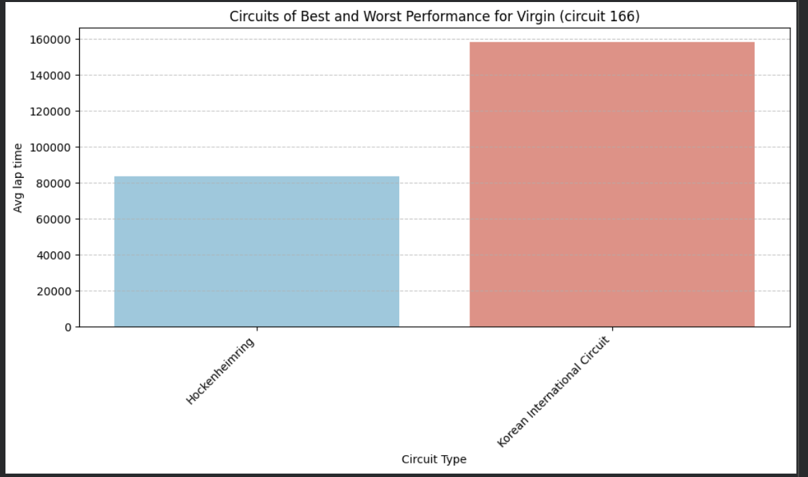</td>
    <td>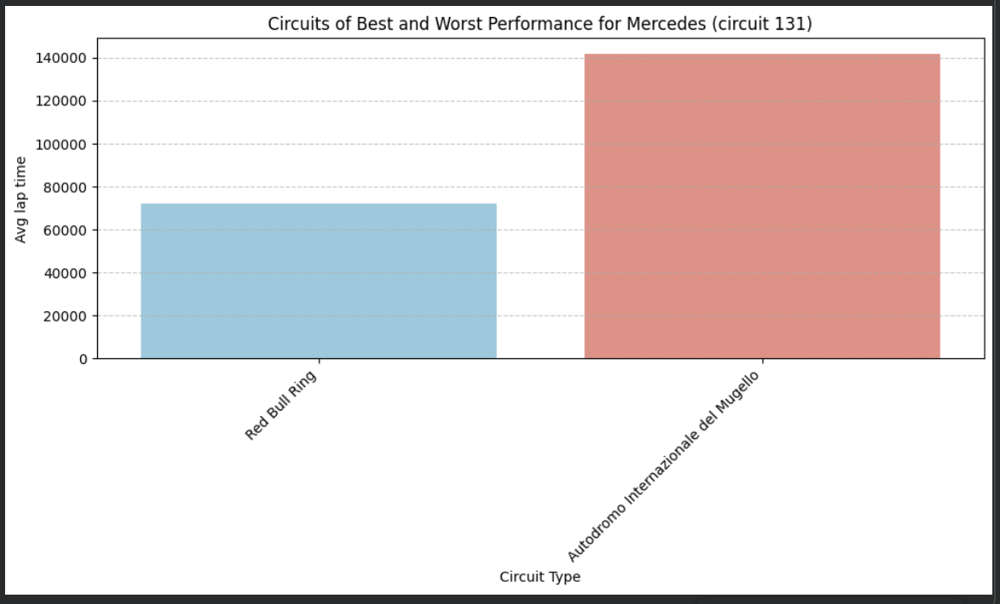</td>
  </tr>
</table>

The first table lists the top 5 largest differences in performance depending on the circuit used. The second plot visualizes the table above, showing the difference in average lap time (max–min) on the y-axis.

The plots with two boxes indicate which circuits hold the maximum and minimum average lap times for the constructors listed in the top 5 above.

Although, in general, Red Bull Ring has the shortest average lap time for many constructors, some constructors such as Spyker perform best on a different circuit and show a large difference between their best and worst performance circuits.

It is also important to note that not all constructors have raced on every circuit listed. For example, as shown in the plot titled "Average Lap Times by Circuit for Spyker(ID: 12)", Spyker has not raced at Red Bull Ring, yet it still demonstrates its best performance on other circuits.

## Conclusion

Q2: Do specific constructors perform better or worse at certain circuits?
A: Yes, circuits affect the performance of each constructor. We found that the Red Bull Ring tends to result in better performance for many constructors. However, even constructors that have not performed at that specific circuit still show that performance varies depending on the circuit, meaning they may perform better or worse at different ones.

Overall, specific constructors do perform better or worse at certain circuits. To examine each constructor’s performance in more detail, the same analysis with a specified constructor ID can be run in the Google Colab notebook. The plot titled "Average Lap Times by Circuit for ..." is useful for identifying each constructor’s best and worst performing circuits.

