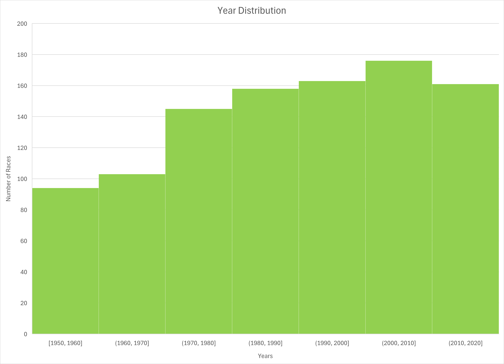
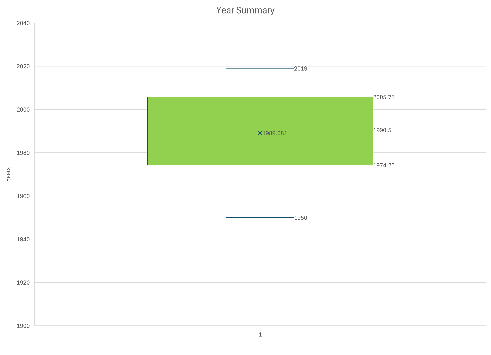

# Data acquisition/loading

https://www.kaggle.com/datasets/rohanrao/formula-1-world-championship-1950-2020

License: CC0: Public Domain

Download the dataset as a ZIP file or follow the instructions on Kaggle to download via the command line

# ETL / cleaning

We cleaned the data by truncating it during the creation of our database.

When we noticed that information was not relevant or mostly NULL, we excluded the column from the schema.

# Storage of cleaned data

We stored the data in a MySQL database, you can create the database using the [Formula 1 Schema](Files/formula1Schema.sql)

# EDA

The [Formula 1 EDA](Files/formula1Queries.sql) looks through the data to make sure we have an even distribution of the data over the last 70 years.

## Plots

The following plots show that there is more data for the recent years versus the older years(1900s).

You can recreate these using [Race Years Excel Workbook](Files/RaceYears.xlsx).

## Insight

The main insight we had was that the earlier years (1950 - 1990) do not have as much data or it is not accurate. Therefore in most of our analysis we are only looking at constructors from the recent years, and pit stops in the recent years.

# Reporting

We had three analytic questions we wanted to answer.

## Q1: How do pit stop times vary between constructors and years: How do pit stop timings differ between constructors and how much has changed over the years. We need to keep in mind that from 2010 to now, Formula 1 removed the need to refuel during the race, this significantly reduced pit-stop time.

[Pit Stop Analysis](../PitStopAnalysis/PitStopAnalysis.md)

## Q2: How well does each constructor perform on average at specific circuits: Do specific constructors perform better or worse at certain circuits. We can determine this by comparing the average lap times between constructors.

[Circuit Analysis](../CircuitAnalysis/CircuitAnalysis.md)

## Q3: regulation change effects: When Formula 1 gets regulation change, how does it affect outcomes: which constructors improve performance, which lose performance. The years when there was a regulation change were 1983, 1994, 1998, 2005, 2009, 2014, 2017, and 2022.

[Regulation Analysis](../RegulationAnalysis/RegulationAnalysis.md)