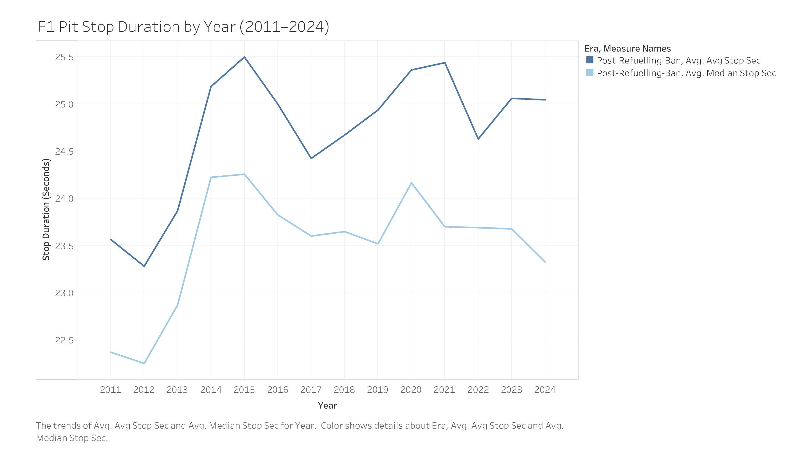
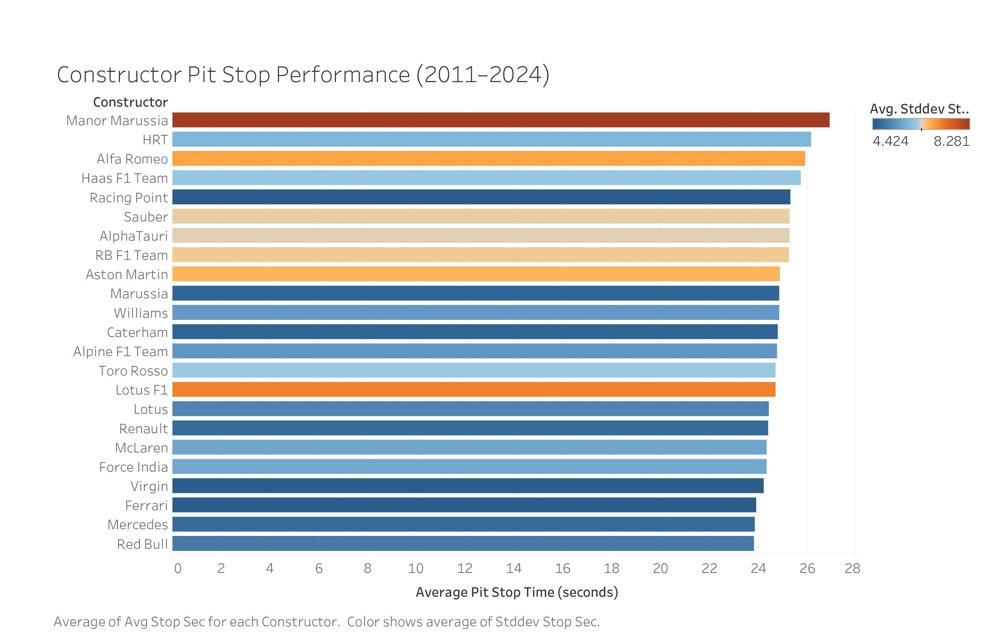
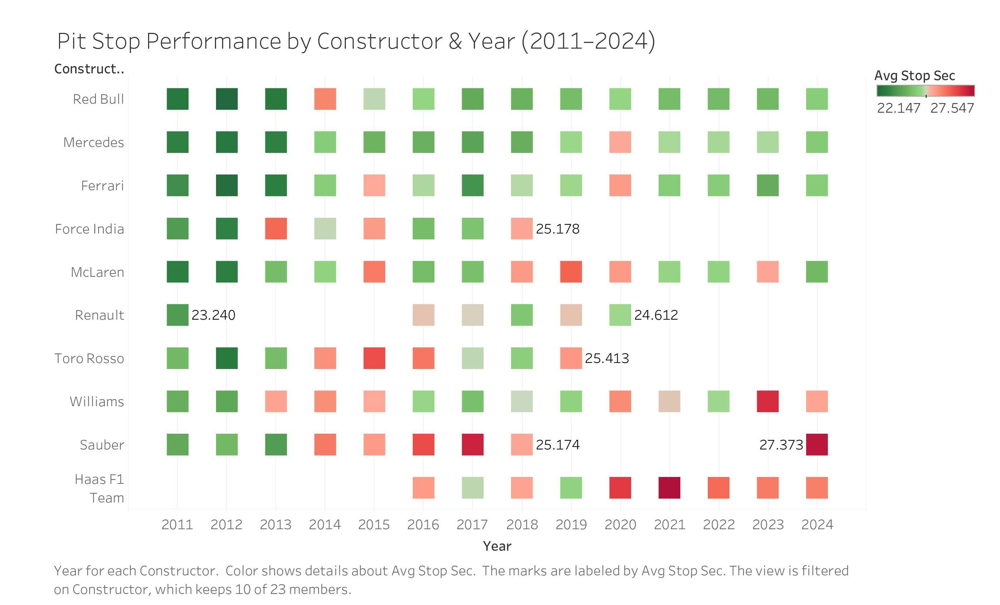
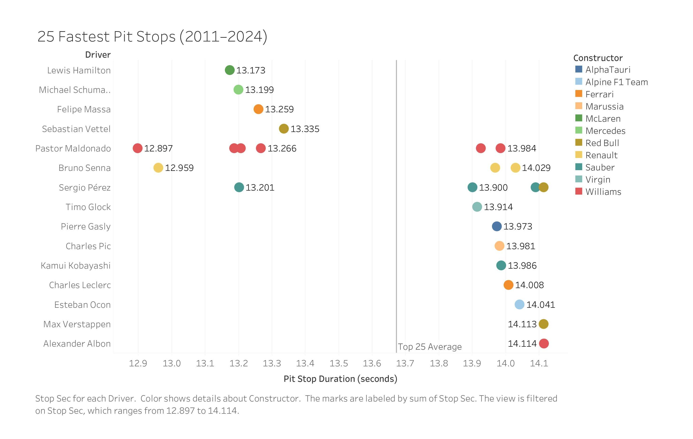

# Pit stop Analysis: How do pit stop times vary between constructors and years

## How do they vary between constructors and how much that changed over the years 
 NOTE: 2010-Present, F1 removed the need to refuel during the race which significantly decreases pit-stop time between these two periods

Pit stops are very critical during an F1 race, constructors (teams) are vital in the duration of pit stops. 

Previous to 2010: pit stops included refueling and changing tires
Present (2010+): pit stops only involve changing tires 

This is important to know as the data stretches back from 1950 to 2024, so the pit stop change from 2010-2024 is drastic and changes the data. Since this question is analyzing how pit stops have changes due to constructors and years we must know: 
    - team performance difference
    - era based differences: Pre-2010 and Post-2010

The source data from Kaggle only contains pit stop data from 2011 onward, meaning we wont see a dramatic shift involving the removal of refueling. This places a limitation on the shift between the pre-2010 era and the post-2010 era analysis, as the results wont be able to cover the affect of the ban. Therefore the following analysis results will only cover 2011 - 2014.

## First Analysis:
## Year-Level Averages (2011 - 2024)

First we want to understand, What was the average pit stop time for each year?

The fastest year average is 2012 at 23.284 seconds. After this we see a large spike from 2012 to 2015 indicating there may have been regulation changes causing this increase of time. The 2014 jump likely indicates the new hybrid power unit regulations increasing stop complexity. After this the trend stabilizes and varies between 24.5 and 25.5 second pit stops. 

We can tell by this visualization that the biggest factor that changes pit stop duration are the regulations imposed on the race. During the refuel era we can assume that pit stops took longer because constructors had to refuel and change tires. At the beginning of the new reforms (2011-2012), pit stops average very low. The spike, indicating the slowest pit stop times occurring at 2015 with an average of 25.500 seconds are due to new regulations implemented. Therefore these regulations have a very large impact on pit stop duration.

 <!-- CHANGE Overall, pit stops have not meaningfully gotten faster over the post-ban period — they peaked early and then slightly regressed, likely due to regulation changes affecting tire compounds and car weight. 
 
 While technological advancements allowed top teams to achieve faster individual pit stops (approaching or even breaking the 2-second barrier), the overall average pit stop duration increased between 2012 and 2015. This is due to regulatory changes in 2014 introducing more complex hybrid power units, along with stricter safety enforcement, which made pit stops more cautious and less consistent across the grid.
 -->

## Second Analysis:
## Constructor Pit Stop Performance (2011 - 2024 Cumulative)

Next we want to analyze each constructor independently. What are each constructors personal average pit stop times across all years?

The constructors with the fastest pit stop average: Red Bull (23.8 seconds)
The constructors with teh slowest pit stop average: Manor Marussia (26.9 seconds)

There only exists an approximate 3 second gap between the fastest and slowest teams, meaning constructors do matter in a race. This is large considering the top 3 fastest constructors differ by 100 millisecond of each other. Three seconds is enough to change positions in a race.

The graph below then ranks the constructors from fastest to slowest bottom-up:

NOTE: One naming issue: "Lotus" and "Lotus F1" are listed separately (85 vs 283 stops). These are the same team across different years but the Kaggle data uses different name strings. 

Standard deviation (std) represents how much a teams pit stop times vary from their own average. The color of the bars represent the standard deviation, blue meaning the average is consistent, and red meaning theres high variety in pit stop times. A low std means a team performs roughly the same the speed every pit stop, meaning they're more reliable and consistent when racing. High std may mean inconsistencies or errors which are a disadvantage when racing.

Therefore pit stop performance is directly  involved with constructor performance and crew quality. Much of the race position can be affected by time spent during a pit stop, therefore constructor efficiency is meaningful.

## Third Analysis:
## Individual Constructor Pit Stop Performance (2011 - 2024)
Next we'll inspect the constructor average pit stop performance closer by looking at their average at each specific year.

The following results are shown as a heatmap, the green represents lower stop average (faster) and red represents higher stop average (slower). The heat map gives us a look at which teams are faster (column comparison) and how performance changes over time (row comparison)

The heatmap indicates a few trends:

- Analyzing constructors (rows), we see that Red Bull, Mercedes, Ferrari are the fastest and most consistent.
- HRT, Manor Marussia, Haas are towards the bottom in redder tones because they are back-markers teams with less pit crew investment
- In 2011: Red Bull was leading, in 2024: McLaren was leading. Rankings show that exceeding in pit stop performance is not a permanent factor, performance will fluctuate.

  
  

Analyzing the heat map by column, we can see 2011 and 2012 were strong years for all teams with consistently fast pit stop times. We also see a following decline in 2014 and 2015 in performance by majority of constructors. These findings directly correspond with our first year-level average line graph where we see a significant increase on average pit stop time during this period. We can point the simultaneous change towards the regulation change. Overall, 2012–2013 column range appears greener while the 2014–2016 period shifts red, reflecting the hybrid era transition adding complexity.

## Fourth Analysis:
## Fastest Individual Pit Stops (2011 - 2024)

To provide more context, we also evaluate the top 25 fastest individual pit stops recorded in the dataset. Our previous analysis were done on year level averages and constructor performance. Instead this query will analyze isolated peak performance. 

We can visually see that the top 25 are split into two clusters, the left resembling the fastest (12.897 - 13.335 seconds) and the right being slower (13.9 - 14.114 seconds). We see the drivers that are a part of the left cluster contain: 
Williams, McLaren, Mercedes, Ferrari, and Red Bull from the 2011 to 2012 seasons. We know this adds up due to the heatmap and what we know about the fastest years recorded.

The right cluster is important a different reason because six of the existing stops occur during the 2022 Dutch Grand Prix. Since these are different constructors producing very similar stop times in the same race, it indicates that the circuit conditions were the primary factor of the fast stops, not the constructors.

What we can takeaway is that the constructor rankings and results we analyzed measure which teams make the fewest mistakes, since see that the teams with the smallest standard deviation tend to produce better results. The gap between fast and slow constructors comes down to consistency.

## Conclusion on Research Question #2: 
## How do pit stop times vary between constructors and years?

Evidence concludes that constructor abilities and year regulations matter in the duration of pit stops. The fastest average was 23.284 seconds in 2012, while the slowest was 2015 at 25.500 seconds. This 2.2 second difference was not driven by team performance, but by regulatory changes. 

The constructor abilities operate within the regulation framework, and furthermore we see that teams that have the most consistency in constructor performance (consistency) do the best in comparison to those that are inconsistent (with large std). 

We have revealed how they influence F1 races: Regulations determine when rules change, meaning all teams are affected equally and immediately. in all regulation eras, the constructor consistent performance is what determines who gains or loses race positions.