# Regulation Analysis

## 2010 Point System Change

One major change was made in 2010, when F1 decided to upgrade the point system.

This increased the number of points a team could acquire, as well as how many places in a race got points.

Before this change, 1st place to 8th place got 10, 8, 6, 5, 4, 3, 2, 1 points respectively.

After 2010, 1st place to 10th place got 25, 18, 15, 12, 10, 8, 6, 4, 2, 1 points respectively.

This change is very clear in the graph below, the dotted line marks the year 2010.

## Regulation Changes Affect on Constructors

There have been over 200 constructors in F1 since the sport first started.

For this analysis I will be looking at the history of the constructors that existed in the 2024 season.

<table>
  <tr>
    <td></td>
    <td></td>
  </tr>
  <tr>
    <td></td>
    <td></td>
  </tr>
  <tr>
    <td></td>
    <td></td>
  </tr>
  <tr>
    <td></td>
    <td></td>
  </tr>
  <tr>
    <td></td>
    <td></td>
  </tr>
</table>

## Specific Constructors With Significant Affects

Let us look at a few specific constructors that have noticeable impacts on their cars after the regulation change.

### Ferrari (2005, 2009, 2014, 2022)

There are three major drops in points that happened during the regulation changes in 2005, 2009, and 2014.

However, in 2022, Ferrari was able to build a good car with the new regulations and significantly increased their points from the previous year by almost 400 points.

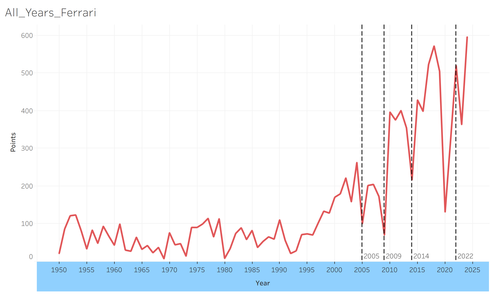

### Mercedes (2014)

The most noticeable impact was in 2014, when Mercedes built a very good car that exploded their points by over 500 points.

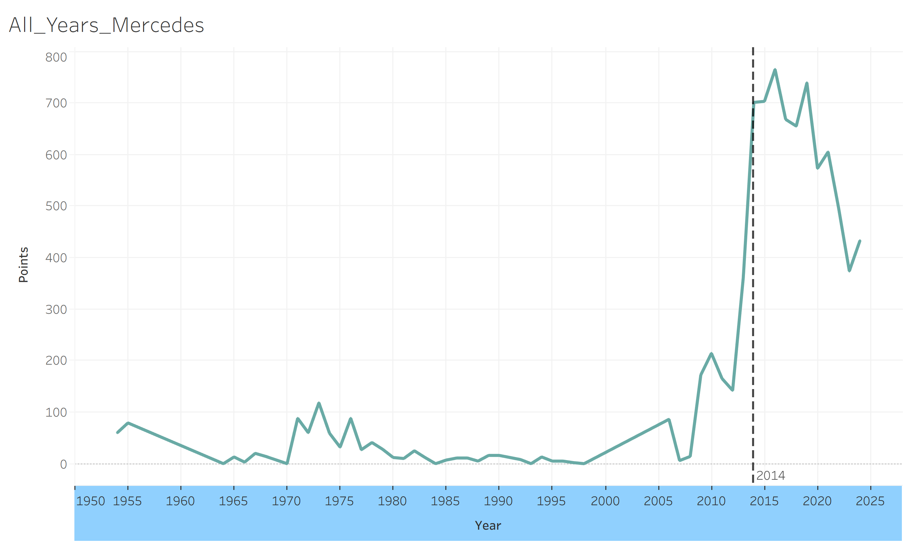

### Sauber (2009, 2014)

Unfortunately, Sauber suffered during the regulation change in both 2009 and 2014, where their overall points drops significantly.

The largest drop in 2014, was the worst, for the first time in history, Sauber did not score a single point all season. The regulation change really threw them off course.

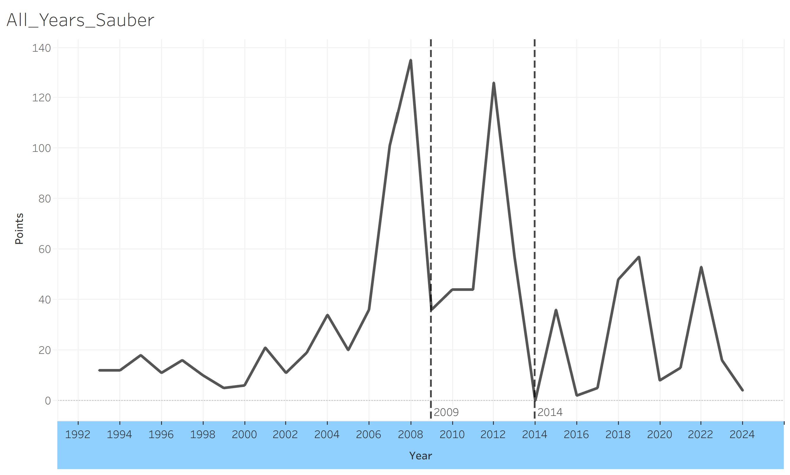

### Williams (2014)

In 2014, Williams adapted well to the regulations and boosted their points from near 0 to over 300 points.

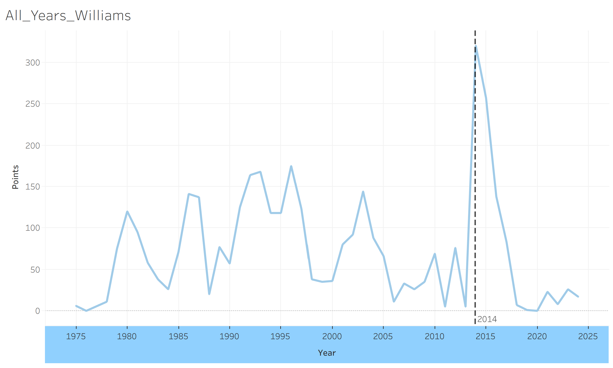

## Regulation Years General View

Now, let's look at each year there was a regulation change, we will now focus on general performance rather than per constructor.

<table>
  <tr>
    <td>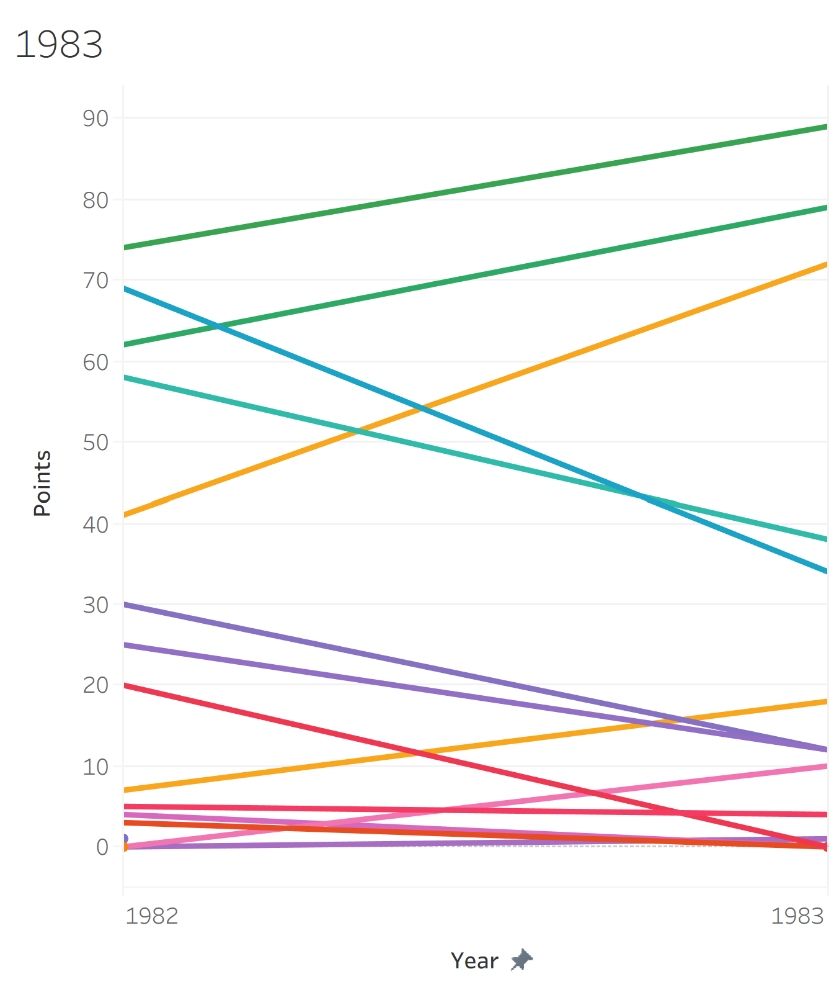</td>
    <td>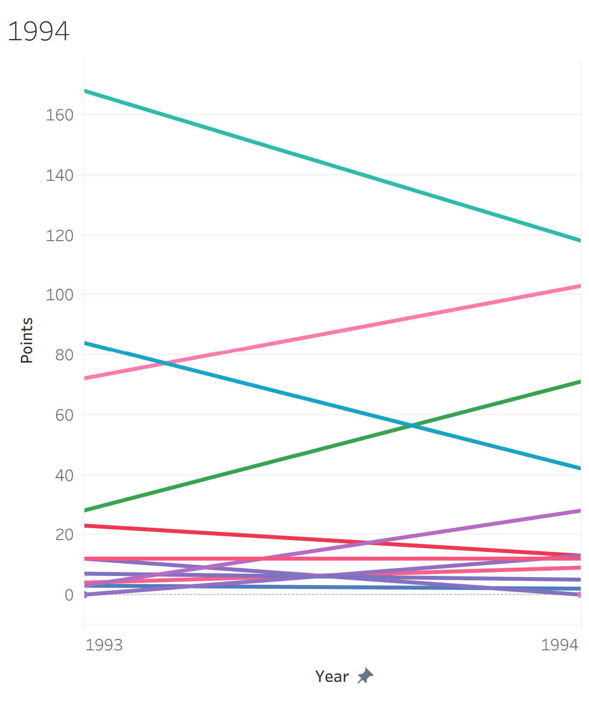</td>
    <td>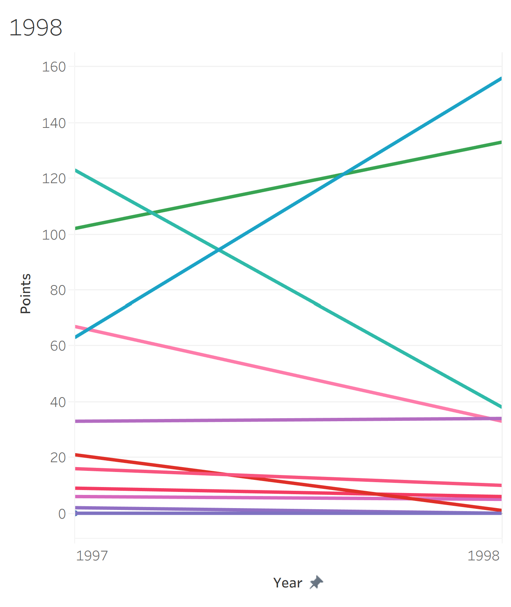</td>
    <td>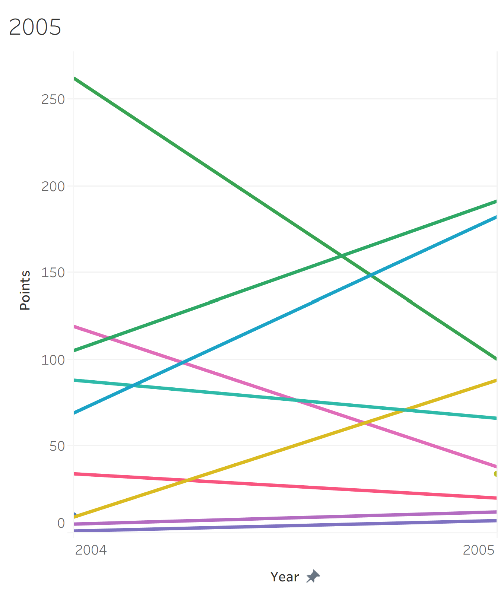</td>
  </tr>
  <tr>
    <td>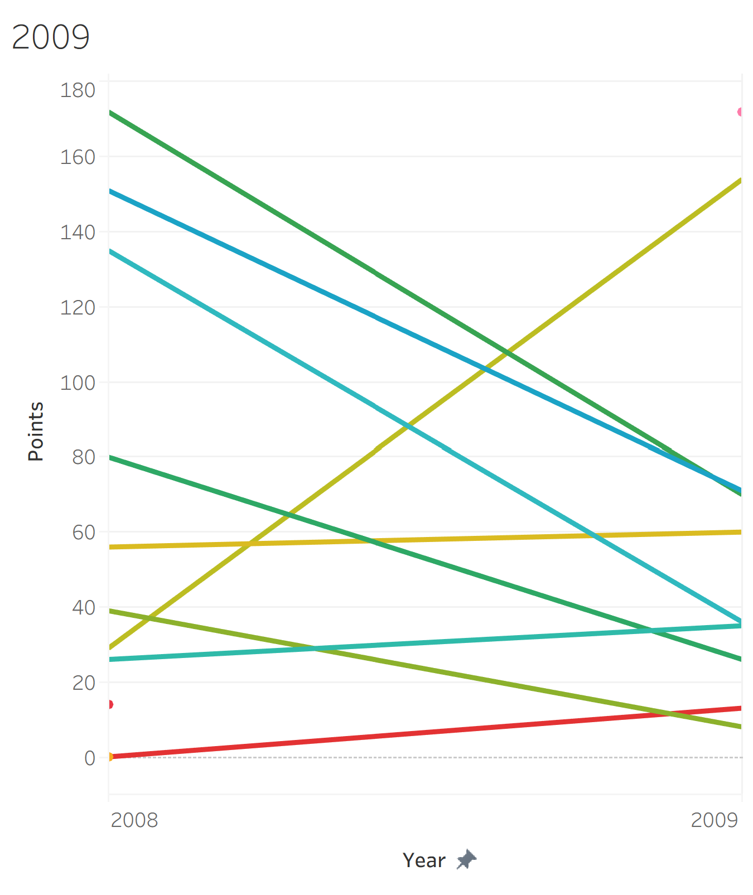</td>
    <td>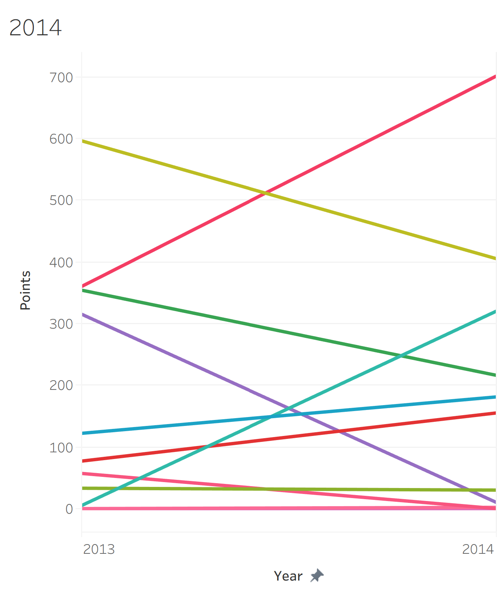</td>
    <td>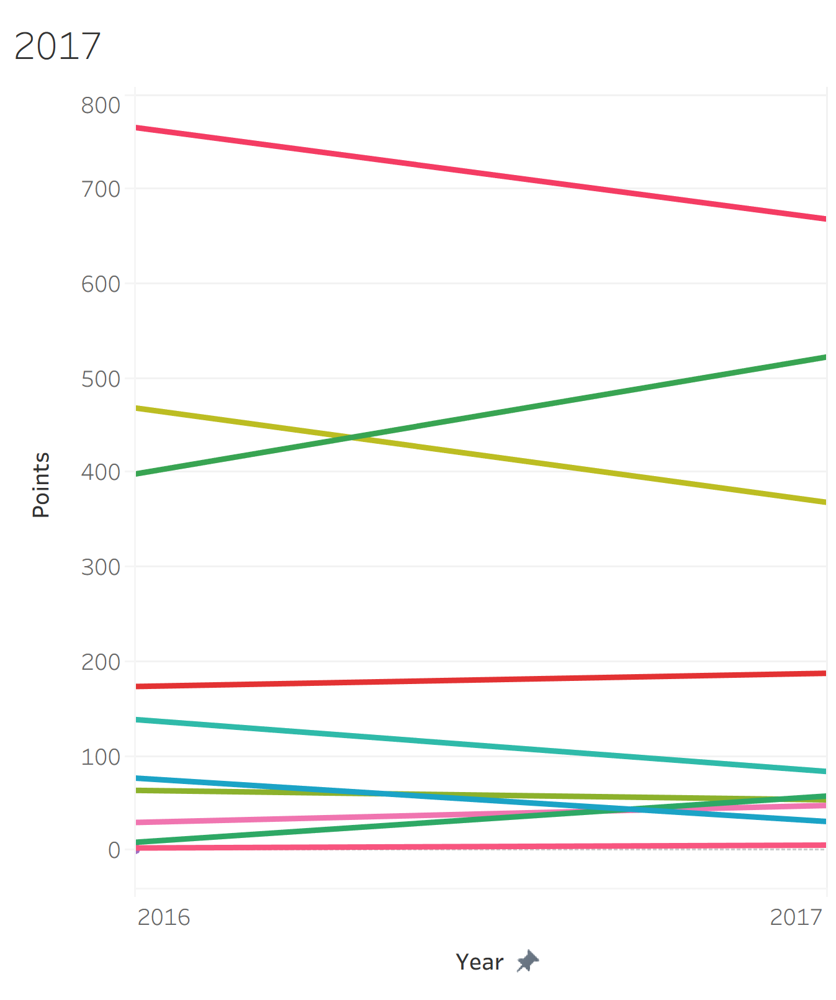</td>
    <td>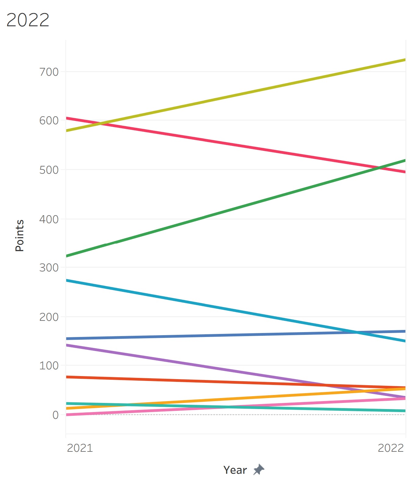</td>
  </tr>
</table>

## Most Impactful Regulation Change Year

We can now identify the regulation change that effected more constructors versus the other years.

In 2009, all of the constructors that had been performing well the previous year suddenly plummeted in performance.

Only one constructor was able to adapt to the regulations, the olive green line that has the steepest upwards slope.

## Conclusion

Overall, it is obvious that the regulation change will always cause a change in performance. If each constructor had the same car and same drivers every year, there wouldn't be any difference in performance. 

Thus, we will not be able to predict which constructor will improve due to the regulation change.