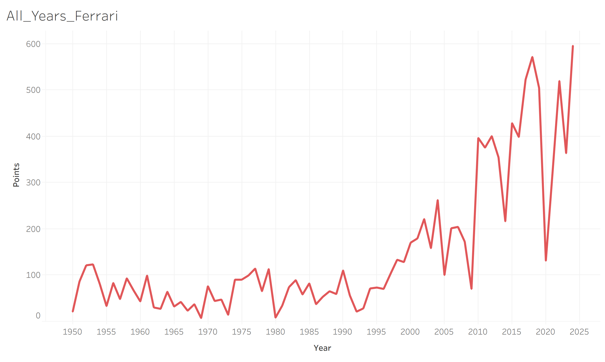
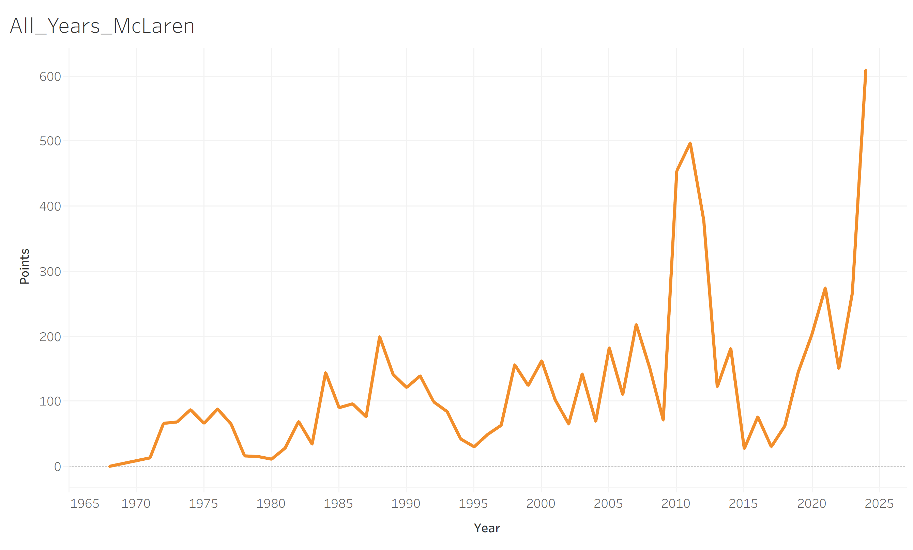
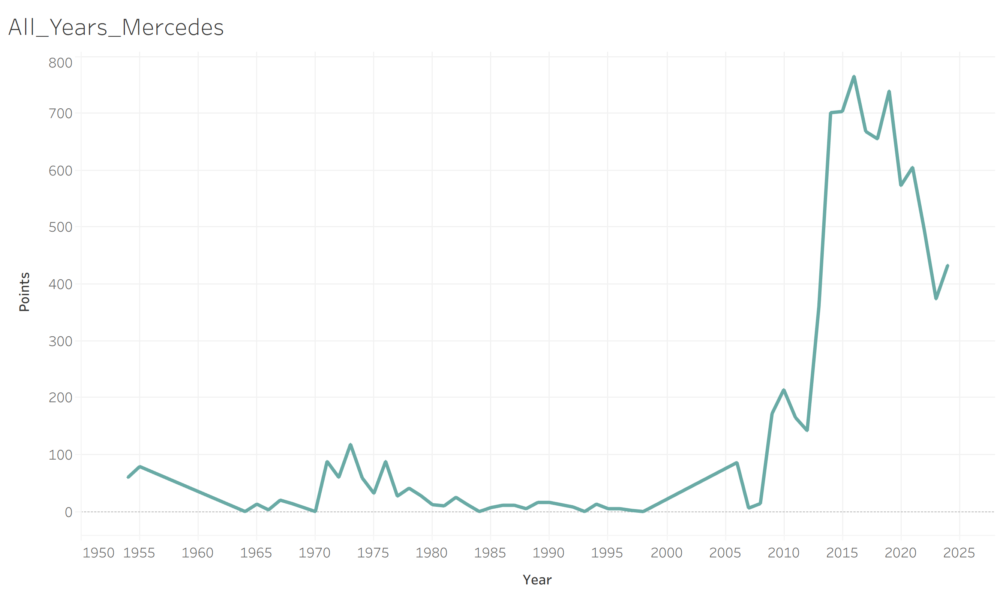
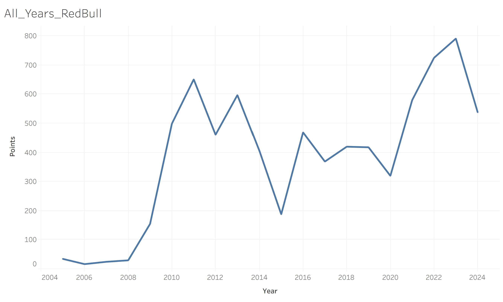
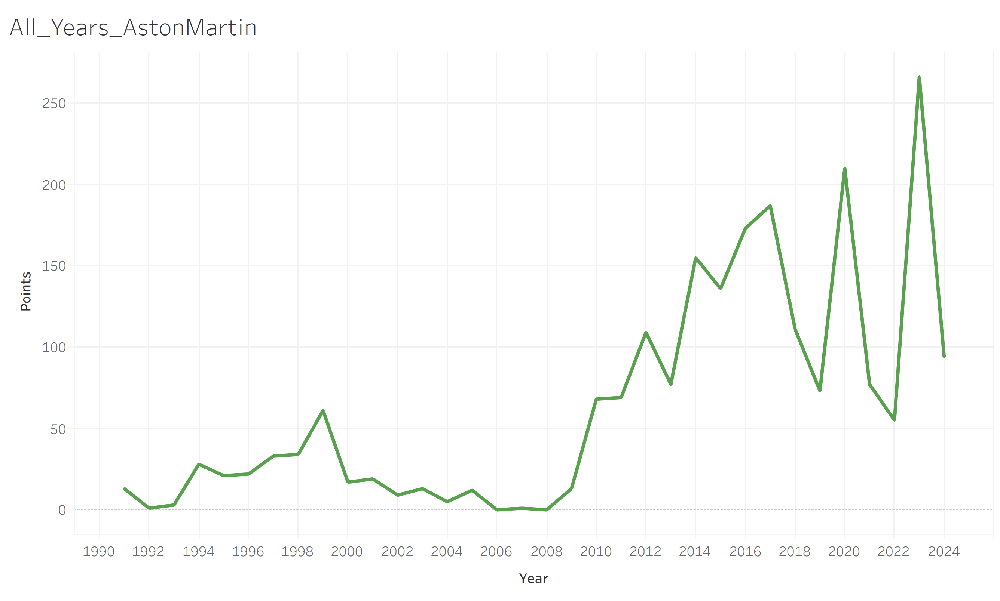
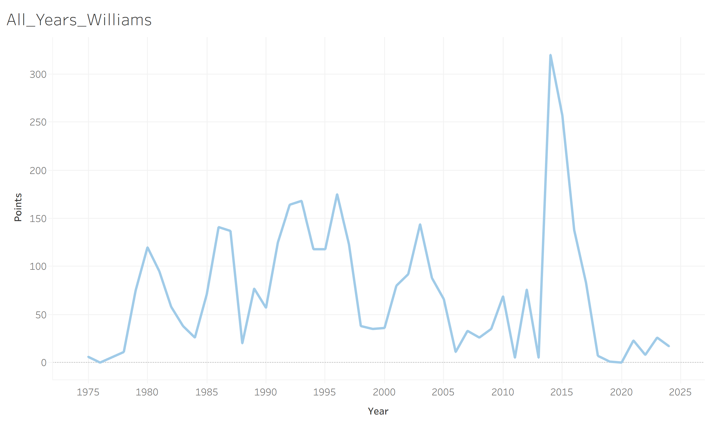
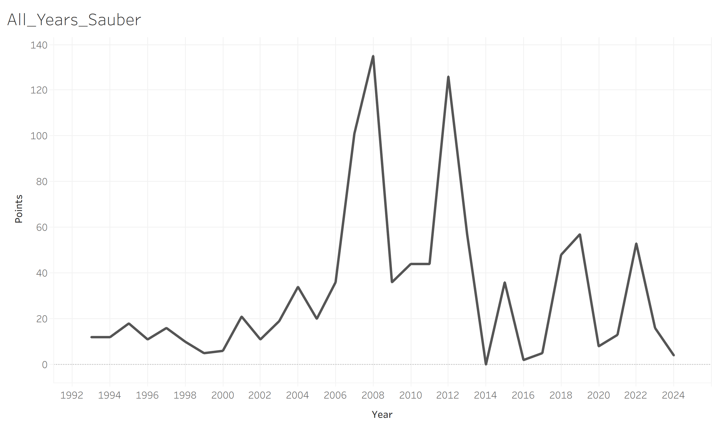
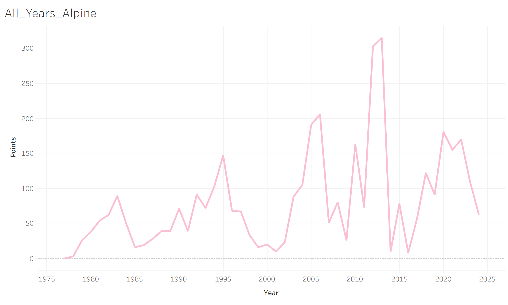
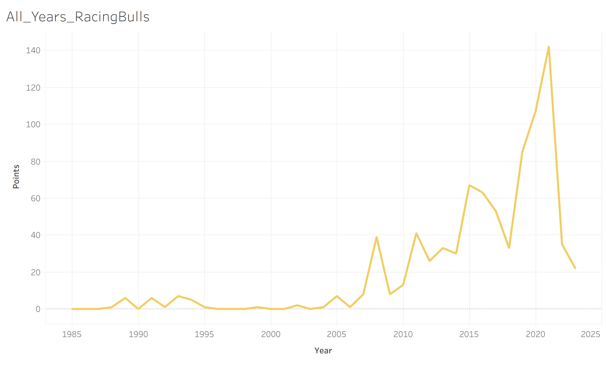
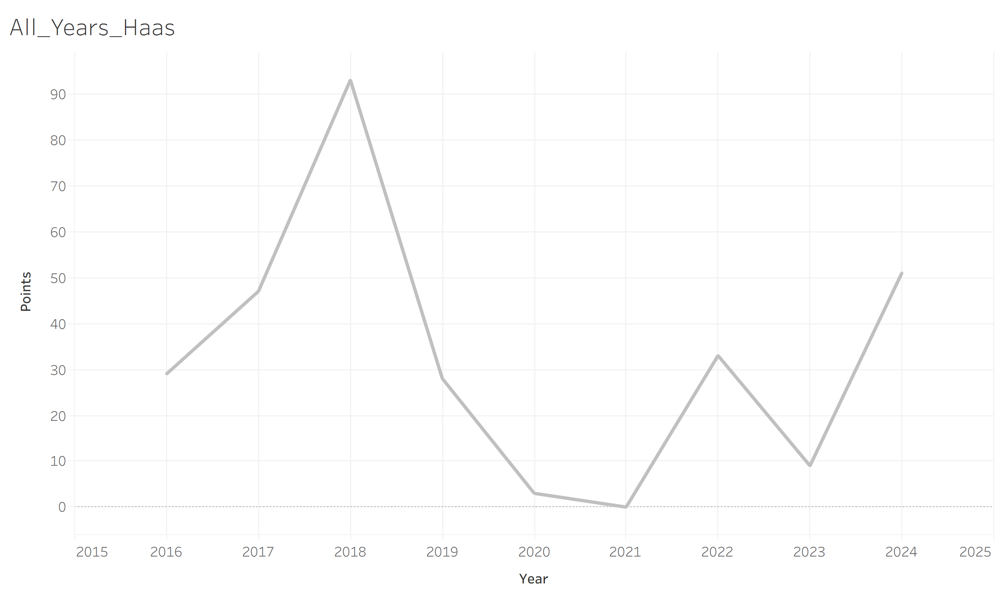

# Regulation Analysis

## 2010 Point System Change

One major change was made in 2010, when F1 decided to upgrade the point system.

This increased the number of points a team could acquire, as well as how many places in a race got points.

Before this change, 1st place to 8th place got 10, 8, 6, 5, 4, 3, 2, 1 points respectively.

After 2010, 1st place to 10th place got 25, 18, 15, 12, 10, 8, 6, 4, 2, 1 points respectively.

This change is very clear in the graph below.

## Regulation Changes Affect on Constructors

There have been over 200 constructors in F1 since the sport first started.

For this analysis I will be looking at the history of the constructors that existed in the 2024 season.

<table>
  <tr>
    <td></td>
    <td></td>
  </tr>
  <tr>
    <td></td>
    <td></td>
  </tr>
  <tr>
    <td></td>
    <td></td>
  </tr>
  <tr>
    <td></td>
    <td></td>
  </tr>
  <tr>
    <td></td>
    <td></td>
  </tr>
</table>

